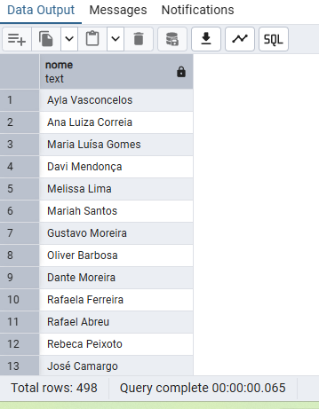

Perguntas SQL
1 - Quantos livros existem cadastrados?
SELECT COUNT(*) FROM livros;

2 - Listar todos os usuários ordenados pelo nome.
SELECT distinct nome FROM usuarios;
 

3 - Mostrar todos os empréstimos realizados no mês atual.
SELECT id_livro, data_emprestimo FROM emprestimos
where extract(month from data_emprestimo) = 05 
and extract(year from data_emprestimo) = 2025
ou
SELECT id_livro, data_emprestimo
FROM emprestimos
WHERE data_emprestimo >= '2025-05-01'
  AND data_emprestimo < '2025-06-01';
   

4 - Mostrar os títulos dos livros emprestados.
SELECT DISTINCT l.titulo
FROM emprestimos AS e
JOIN livros AS l ON e.id_livro = l.id_livro;
 	

5 - Listar o nome dos usuários que pegaram livros emprestados.
SELECT distinct U.nome
from emprestimos as e
join usuarios as U
	on E.id_usuario = U.id_usuario
 

6 - Quantos livros diferentes foram emprestados ao menos uma vez?
SELECT COUNT(DISTINCT e.id_livro) AS total_livros_emprestados
FROM emprestimos AS e;
 

7 - Quantos usuários distintos fizeram empréstimos?
SELECT COUNT(DISTINCT e.id_usuario) AS total_usuarios_emprestaram
FROM emprestimos AS e;
 

8 - Listar os 10 autores com mais livros cadastrados.
SELECT autor, COUNT(*) AS total_livros
FROM livros
GROUP BY autor
ORDER BY total_livros DESC
LIMIT 10;
 

9 - Mostrar os 5 livros mais emprestados.
Select count(e.id_livro) as Contagem, l.titulo
from emprestimos as e
JOIN livros as l on e.id_livro = l.id_livro
group by titulo
order by count(e.id_livro) DESC
fetch first 5 rows only
 

10 - Listar os usuários que mais fizeram empréstimos.
Select count(e.id_usuario) as Contagem, U.nome
from emprestimos as e
JOIN usuarios as U on e.id_usuario = U.id_usuario
group by nome
order by count(e.id_usuario) DESC
 

11 - Listar todos os empréstimos ativos hoje (data_devolucao > CURRENT_DATE).
SELECT l.titulo, e.data_emprestimo
FROM livros AS l
JOIN emprestimos AS e ON e.id_livro = l.id_livro
WHERE e.data_devolucao > CURRENT_DATE;
 

12 - Listar os livros que nunca foram emprestados.
SELECT l.id_livro, l.titulo
FROM livros AS l
LEFT JOIN emprestimos AS e ON l.id_livro = e.id_livro
WHERE e.id_livro IS NULL;
 

13 - Mostrar os usuários que emprestaram mais de 5 livros.
Select count(e.id_usuario) as Contagem, U.nome
from emprestimos as e
JOIN usuarios as U on e.id_usuario = U.id_usuario
group by nome
having count(e.id_usuario) > 5
order by count(e.id_usuario) DESC
 

14 - Calcular a média de tempo de empréstimo (em dias) por usuário.
SELECT U.nome, ROUND(AVG(e.data_devolucao - e.data_emprestimo),2) as dias_emprestimos
FROM emprestimos as e
JOIN usuarios as U ON u.id_usuario = e.id_usuario
group by nome
order by dias_emprestimos DESC 
 

15 - Listar os livros mais emprestados por gênero.
WITH livros_por_genero AS (
    SELECT
        l.genero,
        l.titulo,
        COUNT(*) AS total_emprestimos,
        RANK() OVER (PARTITION BY l.genero ORDER BY COUNT(*) DESC) AS posicao
    FROM emprestimos AS e
    JOIN livros AS l ON l.id_livro = e.id_livro
    GROUP BY l.genero, l.titulo
)
SELECT genero, titulo, total_emprestimos
FROM livros_por_genero

WHERE posicao = 1;
 

16 - Listar os 5 usuários que mais pegaram livros de “Ficção”.
WITH contagem_usuario AS (
    SELECT
        e.id_usuario,
        COUNT(*) AS contagem
    FROM livros AS l
    JOIN emprestimos AS e ON e.id_livro = l.id_livro
    WHERE l.genero = 'Ficção'
    GROUP BY e.id_usuario
)
SELECT u.nome, cu.contagem
FROM contagem_usuario AS cu
JOIN usuarios AS u ON u.id_usuario = cu.id_usuario
ORDER BY cu.contagem DESC
LIMIT 5;
 

17 - Encontrar o autor cujo livro teve o maior tempo total emprestado (em dias somados).
SELECT l.autor, ROUND(SUM(e.data_devolucao - e.data_emprestimo),2) as dias_emprestimos
FROM emprestimos as e
JOIN livros as l ON l.id_livro = e.id_livro
group by autor
order by dias_emprestimos DESC 
LIMIT 1;
 

18 - Para cada mês do último ano, mostrar quantos empréstimos foram feitos.
SELECT
    TO_CHAR(data_emprestimo, 'YYYY-MM') AS mes,
    COUNT(*) AS total_emprestimos
FROM emprestimos
WHERE data_emprestimo >= CURRENT_DATE - INTERVAL '12 months'
GROUP BY mes
ORDER BY mes;
 

19 - Listar o livro com maior quantidade de empréstimos por mês.
WITH contagem_por_mes AS (
    SELECT
        l.titulo,
        EXTRACT(YEAR FROM e.data_emprestimo) AS ano,
        EXTRACT(MONTH FROM e.data_emprestimo) AS mes,
        COUNT(*) AS total_emprestimos,
        RANK() OVER (
            PARTITION BY EXTRACT(YEAR FROM e.data_emprestimo), EXTRACT(MONTH FROM e.data_emprestimo)
            ORDER BY COUNT(*) DESC
        ) AS posicao
    FROM emprestimos AS e
    JOIN livros AS l ON l.id_livro = e.id_livro
    GROUP BY l.titulo, ano, mes
)
SELECT titulo, ano, mes, total_emprestimos
FROM contagem_por_mes
WHERE posicao = 1
ORDER BY ano, mes;
 
20 - Listar os usuários que emprestaram livros consecutivamente (sem intervalo entre devolução e novo empréstimo).

SELECT 
    u.nome,
    e.id_usuario,
    e.id_emprestimo,
    e.data_emprestimo,
    e.data_devolucao,
    e.devolucao_anterior
FROM (
    SELECT *,
           LAG(data_devolucao) OVER (PARTITION BY id_usuario ORDER BY data_emprestimo) AS devolucao_anterior
    FROM emprestimos
) AS e
JOIN usuarios AS u ON u.id_usuario = e.id_usuario
WHERE e.data_emprestimo = e.devolucao_anterior
ORDER BY e.id_usuario, e.data_emprestimo;
 
